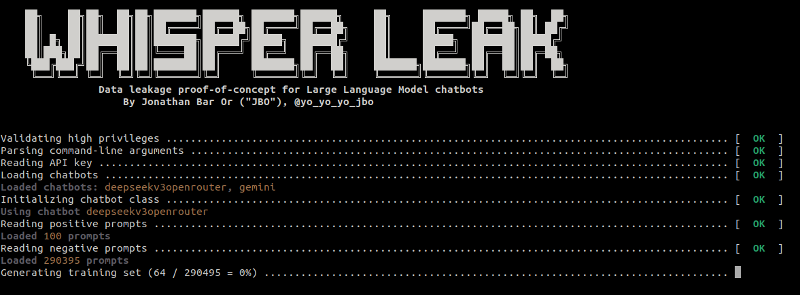

# About
Whisper Leak is a proof-of-concept attack for side-channel attack on Large Language Model chatbots.  
The idea is that communications between a user and the chatbot is TLS-encrypted, but:

1. Chatbots generate tokens one-at-a-time since it's computationally expensive, and humans do not like to wait. Therefore, even if the data is encrypted, the data is sent in chunks with certain times between each chunk.
2. The TLS channel often uses stream ciphers such as [AES-GCM](https://en.wikipedia.org/wiki/Galois/Counter_Mode) or [ChaCha20](https://en.wikipedia.org/wiki/ChaCha20-Poly1305), which means data sizes might be linear to the token reported.

Therefore, there are inherent side-channel attack ideas assuming an adversary can train a large model and sniff packets between the client and the chatbot.  
In this project, we demonstrate how a passive sniffer can distinguish a set of prompts (we call *positive prompts*) from a set of "normal looking" prompts (which we call *negative prompts*).

## How to use
First, install the requirements:

```
python3 -m pip install -r ./requirements.txt
```

Secondly, there are two modes of operation, and therefore two executable files.

### Data collection
Run `whisper_leak_collect.py`. Note it performs network sniffing, thus requiring to run in high privileges.  
The following commandline illustrate how to use Whisper Leak:

```
./whisper_leak_collect.py -c gemini -a ./api_key.txt -p ./prompts.json
```

The flags are:
- `-c` - the chatbot name.
- `-a` - the API key filename.
- `-p` - the JSON prompts file, contains both positive and negative prompts and their repeat counts.
- `-t` - an *optional* integer for the TLS port used by the chatbot (443 by default).

When used, a directory called `training_set` is created and will contain the training set (see more on training in the software architecture piece).

#### Prompts file structure
The prompts file must adhere to the following JSON format:
- Incldes a key called `positive` and a key called `negative`.
- Each of those types has a `repeat` strictly positive integer.
- Each of those types has a non-empty list called `prompts` which contains prompt strings.

Here is an example:

```json
{
  "positive": {
    "repeat": 4,
    "prompts": [
      "How much wood would a woodchuck chuck if a woodchuck could chuck wood?",
      "Give me a complete walkthrough of The Secret of the Monkey Island"
    ]
  },
  "negative": {
    "repeat": 1,
    "prompts": [
      "What is the meaning of life, the universe, and everything else?",
      "Why should you carry a towel?"
    ]
  }
}
```

## Software architecture
Whisper Leak was built to be easily extensible for different chatbots and models.  
In a nutshell, the flow of the program is as follows:
1. Given a chatbot (with a suitable API key) and prompts, generate labeled data by experimenting with the chatbot. Note training data persists to save the costly retraining.
2. Extract a *sequence* from training data. The sequence is a list of `TLS ApplicationData` packet sizes, split by the time between packets in milliseconds.
3. Build a model from the sequence.

### Chatbot interfaces
All chatbot interfaces exist as Python files under the `chatbots` directory.  
They all must inherit from `ChatbotBase` base class, and implement methods to send prompts *asynchronously* be finishes.  
The following code illustrate how to implement such an interface:

```python
from core.chatbot_base import ChatbotBase

class CustomChatbot(ChatbotBase):
    """
        Custom chatbot.
    """

    def __init__(self, api_key, remote_tls_port=443):
        """
            Creates an instance.
        """

        # Call superclass
        super().__init__(api_key, remote_tls_port)

        # TODO - more initialization code that might use the API key etc.
        pass

    def send_prompt(self, prompt, temperature):
        """
            Sends a prompt. Pulls data back as fast as possible (asynchronously) but waits.
            Returns a tuple of (response, local_port) - if local port cannot be determined return (response, None).
        """

        # TODO - send prompt and get responses asynchronously while waiting for them - return the response eventually
        # TODO - try to fetch the local TCP port if possible
        pass

    def get_temperature(self):
        """
            Gets the temperature of the model.
        """

        # TODO - get temperature (can be random)
        pass
```

#### Asyncio
There are some issues with the `asyncio` module since the chatbot modules are loaded with `importlib`.  
The best way I found to solve that issue is to create a new loop if there isn't one.  
For example, if we assume an `async` method called `send_prompt_async`, you could do the following:

```python
# Make sure we have an asyncio loop
try:
    loop = asyncio.get_running_loop()
except RuntimeError:
    loop = asyncio.new_event_loop()
    asyncio.set_event_loop(loop)

# Send prompt
loop.run_until_complete(self.send_prompt_async(prompt))
```

### Sniffing
To create labeled data, we need to sniff network packets.  
No matter how much I tried, I always got problems with `pyshark` (at least on macOS), which is the reason I use `subprocess` to spawn `tcpdump`.  
Therefore, our algorithm does the following:
1. Starts sniffing using `tcpdump` with a filter that looks for the remote port.
2. Performs the chatbot interaction.
3. Finds new TCP local sockets by our own process.
4. Stops sniffing and only take into account TLS cases where the local port is the port we have discovered.

### Datapoints
Data collection and training are done by matching prompts with sniffed TLS data.  
Since we do not want to retrain the data everytime we run Whisper Leak, a directory called `training_set` is created.  
In it, files starting with the hash of the prompts are saved. This assures changes to the prompts create new training sets, but data could be reused assuming prompts do not change.  
The filename format is: `<prompt_sha1>_<index>_<chatbotname>[.pcap|.seq]`.  
When collecting data, a `pcap` file is saved for each prompt and each repetition, alongside a `sequence` file.  
The `pcap` file contains the raw sniffing of data, while the `sequence` file is the serialization of the aforementioned `ApplicationData` byte sizes and times between those chunks of data.  
The `sequence` files have a `.seq` as an extension, and is in JSON format. It has the following data:
- The `local_port` that was used (as an integer between 1 and 65535).
- The `remote_port` of the server (as an integer between 1 and 65535).
- The `prompt` (as a non-empty string).
- The server's `response` (as a non-empty string).
- The `temperature` (as a floating-point number between 0.0 and 2.0).
- A non-empty non-negative integer array with the name `data_lengths`, each of which represents TLS Application Data data sizes.
- A non-empty non-negative floating-point array with the name `time_diffs`, each of which represents the time in milliseconds between the last communication.
The two arrays must have the same size, and the first element in `time_diffs` represent the time between the TLS handshake and the first TLS application data.

For example:

```json
{
  "local_port": 39798,
  "remote_port": 443,
  "prompt": "What is the meaning of life?",
  "response": "I think it is 42",
  "temperature": 1.0,
  "data_lengths": [
    104,
    1337
  ],
  "time_diffs": [
    7331,
    666
  ]
}
```

